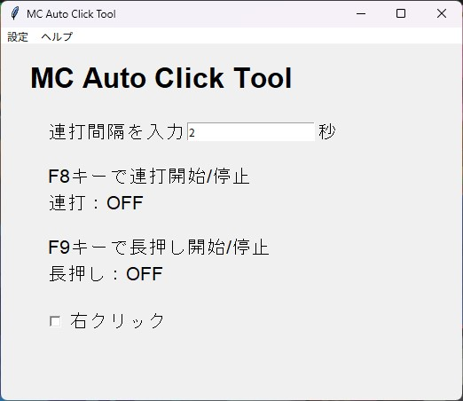

# MC-Auto-Click-Tool

Minecraftに特化した連打ツールです。

[ダウンロードはこちら](https://github.com/tamago572/MC-Auto-Click-Tool/releases)

**ウイルス判定されますが安全です**

## 機能

- 左クリック/右クリックを指定できます
- 連打するか、長押しにするか指定できます
- このアプリのウィンドウを操作しなくても、特定のキーを押して処理を開始できます

## 使い方

### 連打間隔

連打の間隔を指定します。

単位は秒で指定します。

小数点に対応しています。

### 右クリックor左クリック

チェックボックスにチェックを入れることで、クリックが右クリックになります。

### ステータス

動作状態が表示されます。そのままです。
